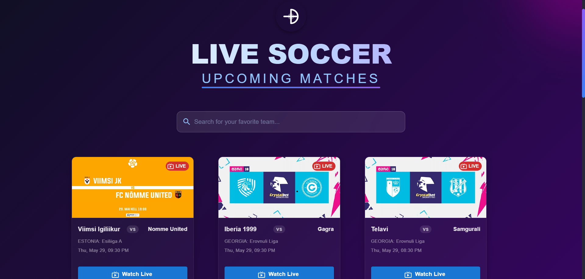
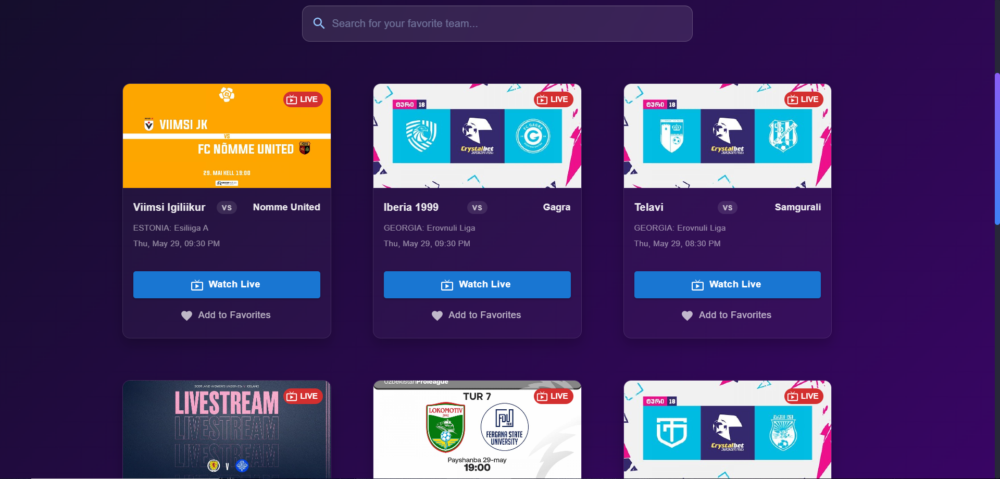
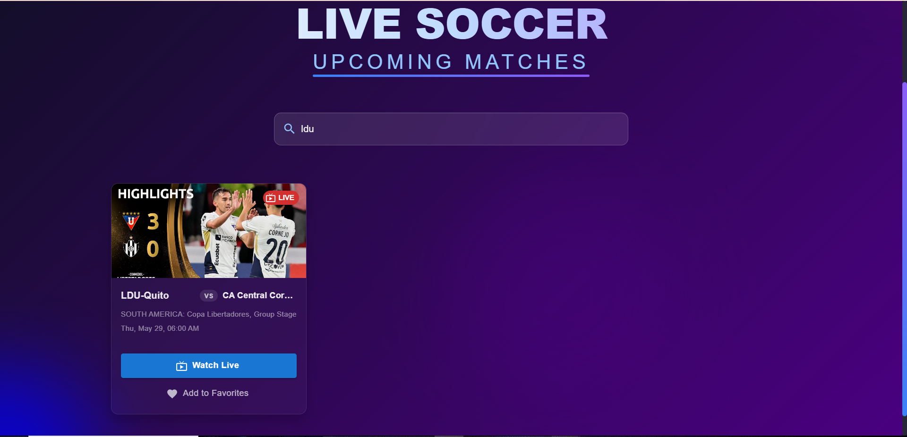
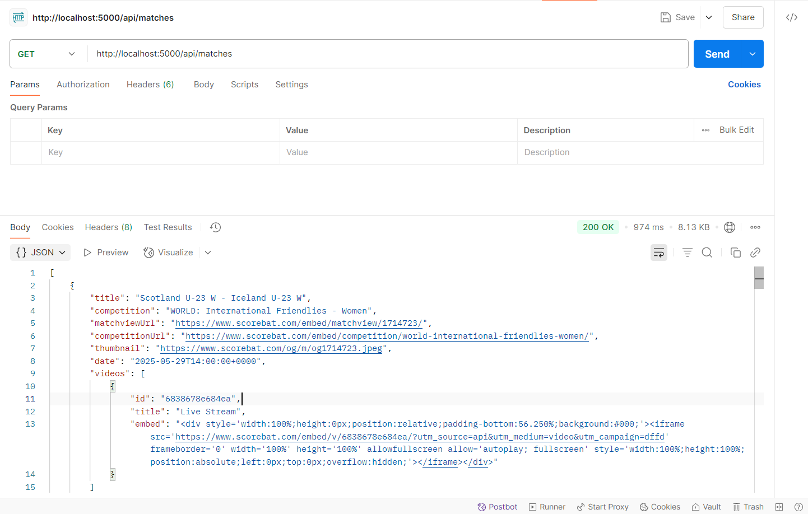

# ⚽ Upcoming Soccer Matches Web App

This is my submission for the **Full Stack Development Internship at SportsOrca**.

---

## 📝 Task

A responsive full-stack web app to view upcoming soccer matches, teams, and match details, with real-time search functionality.

---

## ✅ What I Have Built

I chose **Soccer** as the sport and built a **responsive web app** that displays upcoming matches with:

- 🧠 **Real-time Search**: Instantly filter matches by team
- 🧾 **Match Info**: Team names and match date/time
- 🌐 **Public API** for live match data
- 🖥️ **Backend** using Node.js and Express.js
- ⚛️ **Frontend** built with React.js
- 🧪 **Tested** using Postman
- 📸 **Clean and responsive UI**

---

## 🌐 API Used

**API:** [https://www.scorebat.com/video-api/v3/](https://www.scorebat.com/video-api/v3/)

> No authentication required. Returns JSON data for upcoming soccer matches.

---

## 🖼️ Project Screenshots

<p align="center">    </p>


### 🧪 Postman Test


---

## 🚀 Tech Stack

| Frontend           | Backend             | Tools               |
|--------------------|---------------------|---------------------|
| React.js, HTML, CSS, JavaScript | Node.js, Express.js  | Postman, Git, GitHub |

---

## 📮 How to Run the Project

1. Clone the repository:
```bash
git clone https://github.com/lokeshvijay7/SoccerApp.git
cd SoccerApp
